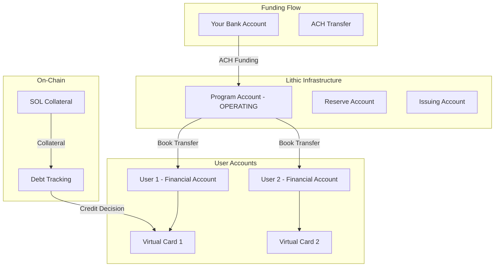

# 🏦 LITHIC DEEP INTEGRATION GUIDE FOR CREDANA

## 📋 Overview
Based on [Lithic's Accounts & Money Movement](https://docs.lithic.com/docs/lithic-send-beta) documentation, we can build a complete end-to-end disbursement and credit card system. This guide covers the REAL Lithic APIs for production deployment.

---

## 🎯 **CREDANA'S ARCHITECTURE WITH LITHIC**



---

## 1️⃣ **FINANCIAL ACCOUNTS STRUCTURE**

According to [Lithic's documentation](https://docs.lithic.com/docs/quick-start-lithic-send), when your program is created, you get:

### Program-Level Accounts:
- **OPERATING**: Main program funding account
- **RESERVE**: Reserve requirements
- **ISSUING**: Card settlement account

### User-Level Accounts:
- Each user gets their own **ISSUING** financial account
- Tracks individual balances and transactions

---

## 2️⃣ **COMPLETE IMPLEMENTATION**

### **Step 1: Create Account Holders with Financial Accounts**

```typescript
// backend/src/services/lithic-accounts-service.ts
import axios from 'axios';

class LithicAccountsService {
  private apiKey: string;
  private baseUrl = 'https://api.lithic.com/v1';
  
  constructor() {
    this.apiKey = process.env.LITHIC_API_KEY!;
  }
  
  /**
   * Create an account holder with BYO KYC
   * This creates both an account and financial account
   */
  async createAccountHolder(user: {
    email: string;
    firstName: string;
    lastName: string;
    phoneNumber: string;
    address: any;
    solanaWallet: string;
  }) {
    const response = await axios.post(
      `${this.baseUrl}/account_holders`,
      {
        email: user.email,
        first_name: user.firstName,
        last_name: user.lastName,
        phone_number: user.phoneNumber,
        address: user.address,
        // BYO KYC - we handle verification
        workflow: 'KYC_BYO',
        // Store Solana wallet in metadata
        metadata: {
          solana_wallet: user.solanaWallet,
          program: 'credana',
          created_at: new Date().toISOString()
        }
      },
      {
        headers: {
          'Authorization': `api-key ${this.apiKey}`,
          'Content-Type': 'application/json'
        }
      }
    );
    
    const accountHolder = response.data;
    
    // Account and Financial Account are created automatically
    console.log('✅ Created Account Holder:', {
      token: accountHolder.token,
      account_token: accountHolder.account_token,
      status: accountHolder.status
    });
    
    // Wait for financial account creation
    await this.waitForFinancialAccount(accountHolder.account_token);
    
    return accountHolder;
  }
  
  /**
   * Get financial account for an account
   */
  async getFinancialAccount(accountToken: string) {
    const response = await axios.get(
      `${this.baseUrl}/financial_accounts`,
      {
        params: {
          account_token: accountToken,
          type: 'ISSUING'
        },
        headers: {
          'Authorization': `api-key ${this.apiKey}`
        }
      }
    );
    
    return response.data.data[0]; // Returns the ISSUING account
  }
  
  /**
   * Wait for financial account to be created
   */
  async waitForFinancialAccount(accountToken: string, maxAttempts = 10) {
    for (let i = 0; i < maxAttempts; i++) {
      try {
        const account = await this.getFinancialAccount(accountToken);
        if (account) return account;
      } catch (e) {
        // Account not ready yet
      }
      await new Promise(resolve => setTimeout(resolve, 1000));
    }
    throw new Error('Financial account creation timeout');
  }
}
```

### **Step 2: Fund Your Program (ACH from Bank)**

```typescript
// backend/src/services/lithic-funding-service.ts
class LithicFundingService {
  /**
   * Fund your program via ACH
   * Based on: https://docs.lithic.com/docs/quick-start-lithic-send
   */
  async fundProgram(amount: number) {
    // Step 1: Create external bank account
    const bankAccount = await this.createExternalBankAccount({
      routing_number: process.env.BANK_ROUTING!,
      account_number: process.env.BANK_ACCOUNT!,
      type: 'CHECKING',
      owner_name: 'Credana Inc',
      verification_method: 'MICRO_DEPOSIT'
    });
    
    // Step 2: Verify bank account (in production)
    await this.verifyBankAccount(bankAccount.token);
    
    // Step 3: Initiate ACH transfer
    const transfer = await axios.post(
      `${this.baseUrl}/ach_transfers`,
      {
        amount: amount * 100, // Convert to cents
        external_bank_account_token: bankAccount.token,
        direction: 'CREDIT', // Money INTO Lithic
        statement_descriptor: 'CREDANA FUNDING'
      },
      {
        headers: {
          'Authorization': `api-key ${this.apiKey}`,
          'Content-Type': 'application/json'
        }
      }
    );
    
    console.log('💰 ACH Transfer initiated:', {
      token: transfer.data.token,
      amount: transfer.data.amount / 100,
      status: transfer.data.status,
      expected_settlement: transfer.data.expected_settlement_date
    });
    
    return transfer.data;
  }
  
  /**
   * For sandbox testing - instant funding
   */
  async sandboxInstantFund(amount: number) {
    // In sandbox, use the funding simulation endpoint
    const response = await axios.post(
      `${this.baseUrl}/simulate/funding`,
      {
        amount: amount * 100,
        type: 'DEPOSIT'
      },
      {
        headers: {
          'Authorization': `api-key ${this.apiKey}`,
          'Content-Type': 'application/json'
        }
      }
    );
    
    console.log('✅ Sandbox funding complete:', amount);
    return response.data;
  }
}
```

### **Step 3: Instant Book Transfers (Disburse to Users)**

```typescript
// backend/src/services/lithic-transfer-service.ts
class LithicTransferService {
  /**
   * Transfer funds from program to user instantly
   * This is the KEY to instant disbursements!
   */
  async disburseToUser(params: {
    userFinancialAccountToken: string;
    amount: number;
    memo?: string;
  }) {
    // Get program's OPERATING account
    const programAccount = await this.getProgramOperatingAccount();
    
    // Create instant book transfer
    const transfer = await axios.post(
      `${this.baseUrl}/book_transfers`,
      {
        from_financial_account_token: programAccount.token,
        to_financial_account_token: params.userFinancialAccountToken,
        amount: params.amount * 100, // Convert to cents
        memo: params.memo || 'Credit line disbursement',
        metadata: {
          type: 'CREDIT_DISBURSEMENT',
          timestamp: new Date().toISOString()
        }
      },
      {
        headers: {
          'Authorization': `api-key ${this.apiKey}`,
          'Content-Type': 'application/json'
        }
      }
    );
    
    console.log('💸 Instant transfer complete:', {
      token: transfer.data.token,
      amount: transfer.data.amount / 100,
      status: transfer.data.status,
      from: transfer.data.from_financial_account_token,
      to: transfer.data.to_financial_account_token
    });
    
    return transfer.data;
  }
  
  /**
   * Get program's OPERATING account
   */
  async getProgramOperatingAccount() {
    const response = await axios.get(
      `${this.baseUrl}/financial_accounts`,
      {
        params: {
          type: 'OPERATING',
          is_program_account: true
        },
        headers: {
          'Authorization': `api-key ${this.apiKey}`
        }
      }
    );
    
    return response.data.data[0];
  }
}
```

### **Step 4: Create Cards Linked to Financial Accounts**

```typescript
// backend/src/services/lithic-card-service.ts
class LithicCardService {
  /**
   * Create a virtual card for Apple Pay
   */
  async createVirtualCard(params: {
    accountToken: string;
    spendLimit?: number;
    state?: 'OPEN' | 'PAUSED';
  }) {
    const response = await axios.post(
      `${this.baseUrl}/cards`,
      {
        account_token: params.accountToken,
        type: 'VIRTUAL',
        state: params.state || 'OPEN',
        spend_limit: params.spendLimit || 100000, // $1000 default
        spend_limit_duration: 'MONTHLY',
        product_id: process.env.LITHIC_PRODUCT_ID,
        metadata: {
          wallet_type: 'APPLE_PAY',
          created_at: new Date().toISOString()
        }
      },
      {
        headers: {
          'Authorization': `api-key ${this.apiKey}`,
          'Content-Type': 'application/json'
        }
      }
    );
    
    const card = response.data;
    
    console.log('💳 Virtual card created:', {
      token: card.token,
      last_four: card.last_four,
      state: card.state,
      spend_limit: card.spend_limit / 100
    });
    
    return card;
  }
  
  /**
   * Provision card to Apple Pay
   */
  async provisionToApplePay(cardToken: string, deviceInfo: any) {
    const response = await axios.post(
      `${this.baseUrl}/cards/${cardToken}/provision`,
      {
        wallet_type: 'APPLE_PAY',
        device_id: deviceInfo.deviceId,
        certificate: deviceInfo.certificate,
        nonce: deviceInfo.nonce,
        nonce_signature: deviceInfo.nonceSignature
      },
      {
        headers: {
          'Authorization': `api-key ${this.apiKey}`,
          'Content-Type': 'application/json'
        }
      }
    );
    
    return response.data;
  }
}
```

### **Step 5: Monitor Balances and Transactions**

```typescript
// backend/src/services/lithic-monitoring-service.ts
class LithicMonitoringService {
  /**
   * Get user's balance (available, pending, total)
   */
  async getUserBalance(accountToken: string) {
    const response = await axios.get(
      `${this.baseUrl}/balances`,
      {
        params: {
          account_token: accountToken
        },
        headers: {
          'Authorization': `api-key ${this.apiKey}`
        }
      }
    );
    
    const balance = response.data.data[0];
    
    return {
      available: balance.available_amount / 100,
      pending: balance.pending_amount / 100,
      total: balance.total_amount / 100,
      currency: balance.currency,
      lastTransaction: balance.last_transaction_token
    };
  }
  
  /**
   * Get financial transactions for an account
   */
  async getFinancialTransactions(financialAccountToken: string) {
    const response = await axios.get(
      `${this.baseUrl}/financial_transactions`,
      {
        params: {
          financial_account_token: financialAccountToken,
          limit: 100
        },
        headers: {
          'Authorization': `api-key ${this.apiKey}`
        }
      }
    );
    
    return response.data.data.map(tx => ({
      token: tx.token,
      category: tx.category,
      status: tx.status,
      result: tx.result,
      amount: tx.settled_amount / 100,
      pending: tx.pending_amount / 100,
      descriptor: tx.descriptor,
      created: tx.created,
      events: tx.events
    }));
  }
  
  /**
   * Real-time balance check for authorization
   */
  async canAuthorize(accountToken: string, amount: number): Promise<boolean> {
    const balance = await this.getUserBalance(accountToken);
    
    // Check available balance
    if (balance.available < amount) {
      console.log('❌ Insufficient balance:', {
        requested: amount,
        available: balance.available
      });
      return false;
    }
    
    // Check on-chain collateral (our addition)
    const onChainCredit = await this.checkOnChainCredit(accountToken);
    const totalCredit = balance.available + onChainCredit;
    
    return totalCredit >= amount;
  }
  
  /**
   * Check on-chain credit (Credana specific)
   */
  async checkOnChainCredit(accountToken: string): Promise<number> {
    // Get user's Solana wallet from metadata
    const account = await this.getAccount(accountToken);
    const solanaWallet = account.metadata?.solana_wallet;
    
    if (!solanaWallet) return 0;
    
    // Check on-chain position
    const position = await this.solanaService.getUserPosition(solanaWallet);
    return position?.availableCredit || 0;
  }
}
```

---

## 3️⃣ **AUTHORIZATION WEBHOOK WITH CREDIT LOGIC**

```typescript
// backend/src/handlers/lithic-auth-handler.ts
class LithicAuthorizationHandler {
  /**
   * Enhanced authorization with on-chain credit
   */
  async handleAuthorization(webhook: any) {
    const { data } = webhook;
    const amount = data.amount / 100;
    const accountToken = data.account_token;
    
    // Step 1: Check Lithic balance
    const balance = await this.monitoring.getUserBalance(accountToken);
    
    // Step 2: Check on-chain collateral
    const account = await this.getAccount(accountToken);
    const solanaWallet = account.metadata?.solana_wallet;
    
    if (!solanaWallet) {
      return {
        approved: false,
        decline_reason: 'NO_WALLET_LINKED'
      };
    }
    
    const onChainPosition = await this.solana.getUserPosition(solanaWallet);
    
    // Step 3: Calculate total available credit
    const lithicBalance = balance.available;
    const onChainCredit = onChainPosition?.availableCredit || 0;
    const totalAvailable = lithicBalance + onChainCredit;
    
    // Step 4: Make decision
    if (amount <= lithicBalance) {
      // Can cover with Lithic balance alone
      return {
        approved: true,
        source: 'LITHIC_BALANCE',
        available_credit: totalAvailable
      };
    } else if (amount <= totalAvailable) {
      // Need to use on-chain credit
      const creditNeeded = amount - lithicBalance;
      
      // Disburse from program to user instantly
      await this.transfer.disburseToUser({
        userFinancialAccountToken: data.financial_account_token,
        amount: creditNeeded,
        memo: `Credit line draw: ${creditNeeded}`
      });
      
      // Record debt on-chain
      await this.solana.recordDebt(solanaWallet, creditNeeded);
      
      return {
        approved: true,
        source: 'ON_CHAIN_CREDIT',
        credit_used: creditNeeded,
        available_credit: totalAvailable - amount
      };
    } else {
      // Insufficient total credit
      return {
        approved: false,
        decline_reason: 'INSUFFICIENT_CREDIT',
        available: totalAvailable,
        requested: amount
      };
    }
  }
}
```

---

## 4️⃣ **CREDIT PRODUCTS INTEGRATION**

Based on [Lithic's Credit documentation](https://docs.lithic.com/docs/credit-products), we can offer:

### **Secured Charge Card Model (Perfect for Credana)**

```typescript
// backend/src/services/lithic-credit-service.ts
class LithicCreditService {
  /**
   * Create a secured charge card program
   * User's SOL collateral backs the credit line
   */
  async createSecuredCreditLine(params: {
    accountToken: string;
    collateralValue: number; // SOL value in USD
    ltv: number; // 60% default
  }) {
    const creditLimit = params.collateralValue * params.ltv;
    
    // Create credit configuration
    const config = await axios.post(
      `${this.baseUrl}/credit_configurations`,
      {
        account_token: params.accountToken,
        credit_limit: creditLimit * 100, // in cents
        credit_product_type: 'SECURED_CHARGE',
        billing_cycle_day: 1,
        payment_due_day: 25,
        interest_rate: 500, // 5% APR in basis points
        metadata: {
          collateral_type: 'SOL',
          collateral_value: params.collateralValue,
          ltv: params.ltv
        }
      },
      {
        headers: {
          'Authorization': `api-key ${this.apiKey}`,
          'Content-Type': 'application/json'
        }
      }
    );
    
    console.log('💳 Secured credit line created:', {
      limit: creditLimit,
      collateral: params.collateralValue,
      ltv: params.ltv
    });
    
    return config.data;
  }
}
```

---

## 5️⃣ **COMPLETE FLOW IMPLEMENTATION**

```typescript
// backend/src/services/credana-complete-flow.ts
class CredanaCompleteFlow {
  async onboardUser(userData: any, solanaWallet: string) {
    // 1. Create account holder
    const accountHolder = await this.accounts.createAccountHolder({
      ...userData,
      solanaWallet
    });
    
    // 2. Get financial account
    const financialAccount = await this.accounts.getFinancialAccount(
      accountHolder.account_token
    );
    
    // 3. Check on-chain collateral
    const position = await this.solana.getUserPosition(solanaWallet);
    const collateralValue = position.collateralValue;
    
    // 4. Create secured credit line
    const creditLine = await this.credit.createSecuredCreditLine({
      accountToken: accountHolder.account_token,
      collateralValue,
      ltv: 0.6
    });
    
    // 5. Create virtual card
    const card = await this.cards.createVirtualCard({
      accountToken: accountHolder.account_token,
      spendLimit: creditLine.credit_limit / 100
    });
    
    // 6. Initial funding (if needed)
    if (collateralValue > 100) {
      await this.transfer.disburseToUser({
        userFinancialAccountToken: financialAccount.token,
        amount: 100, // $100 initial credit
        memo: 'Welcome bonus'
      });
    }
    
    return {
      accountHolder,
      financialAccount,
      creditLine,
      card,
      collateralValue,
      availableCredit: creditLine.credit_limit / 100
    };
  }
  
  async handleSpend(authRequest: any) {
    // Real-time authorization with on-chain backing
    return this.authHandler.handleAuthorization(authRequest);
  }
  
  async settleDaily() {
    // Daily settlement process
    const transactions = await this.monitoring.getFinancialTransactions();
    
    for (const tx of transactions) {
      if (tx.status === 'SETTLED' && tx.category === 'CARD') {
        // Record on-chain debt
        await this.solana.recordDebt(tx.account_token, tx.amount);
      }
    }
  }
}
```

---

## 6️⃣ **SANDBOX TESTING COMMANDS**

```bash
# Test complete flow
curl -X POST https://sandbox.lithic.com/v1/simulate/authorize \
  -H "Authorization: api-key $LITHIC_API_KEY" \
  -d '{
    "card_token": "YOUR_CARD_TOKEN",
    "amount": 5000,
    "descriptor": "COFFEE SHOP"
  }'

# Check balance
curl https://sandbox.lithic.com/v1/balances \
  -H "Authorization: api-key $LITHIC_API_KEY" \
  -G -d account_token=YOUR_ACCOUNT_TOKEN

# Simulate funding
curl -X POST https://sandbox.lithic.com/v1/simulate/funding \
  -H "Authorization: api-key $LITHIC_API_KEY" \
  -d '{
    "amount": 1000000,
    "type": "DEPOSIT"
  }'
```

---

## 🚀 **PRODUCTION DEPLOYMENT CHECKLIST**

### Week 1: Foundation
- [ ] Get production API keys from Lithic
- [ ] Set up ACH bank account for funding
- [ ] Implement account holder creation
- [ ] Test financial account creation
- [ ] Implement book transfers

### Week 2: Credit Logic
- [ ] Integrate on-chain collateral checking
- [ ] Implement secured credit line creation
- [ ] Build authorization webhook handler
- [ ] Test instant disbursements
- [ ] Implement debt recording

### Week 3: Go Live
- [ ] Apple Pay provisioning
- [ ] Production webhook endpoints
- [ ] Monitoring dashboards
- [ ] Settlement automation
- [ ] Launch with beta users

---

## 💡 **KEY INSIGHTS FROM LITHIC DOCS**

1. **Instant Book Transfers**: The key to instant disbursements
2. **Financial Accounts**: Automatic creation with account holders
3. **BYO KYC**: We control the KYC process
4. **Secured Charge Cards**: Perfect model for collateral-backed credit
5. **Real-time Authorization**: Webhook-based instant decisions

**This is the complete blueprint for production Lithic integration!** 