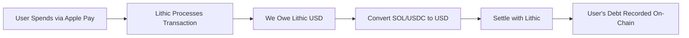

# 💸 OFF-RAMP INTEGRATION GUIDE FOR CREDANA

## Overview
To complete the Apple Pay → Real SOL → Real Store flow, we need to integrate off-ramp services that convert crypto to fiat for settling with Lithic.

## 🎯 **THE FLOW**


---

## 1️⃣ **CIRCLE (RECOMMENDED FOR USDC)**
[Documentation](https://developers.circle.com/)

### Why Circle?
- ✅ Direct USDC → USD conversion (1:1)
- ✅ Instant settlement
- ✅ No slippage
- ✅ Enterprise-grade APIs
- ✅ Best for stablecoin operations

### Integration Steps:

```typescript
// backend/src/services/circle-off-ramp.ts
import axios from 'axios';

class CircleOffRampService {
  private apiKey: string;
  private baseUrl = 'https://api.circle.com/v1';
  
  constructor() {
    this.apiKey = process.env.CIRCLE_API_KEY!;
  }
  
  /**
   * Convert USDC to USD and send to bank account
   */
  async convertUSDCtoUSD(amount: number, bankAccountId: string) {
    // Step 1: Create payout
    const payout = await axios.post(
      `${this.baseUrl}/payouts`,
      {
        idempotencyKey: `payout_${Date.now()}`,
        source: {
          type: 'wallet',
          id: process.env.CIRCLE_WALLET_ID
        },
        destination: {
          type: 'bank_account',
          id: bankAccountId // Your Lithic settlement account
        },
        amount: {
          amount: amount.toFixed(2),
          currency: 'USD'
        },
        metadata: {
          beneficiaryEmail: 'treasury@credana.io'
        }
      },
      {
        headers: {
          'Authorization': `Bearer ${this.apiKey}`,
          'Content-Type': 'application/json'
        }
      }
    );
    
    return payout.data;
  }
  
  /**
   * Get real-time USDC balance
   */
  async getUSDCBalance() {
    const response = await axios.get(
      `${this.baseUrl}/wallets/${process.env.CIRCLE_WALLET_ID}`,
      {
        headers: {
          'Authorization': `Bearer ${this.apiKey}`
        }
      }
    );
    
    return response.data.balances.find(b => b.currency === 'USD');
  }
}
```

### Setup Requirements:
1. **Apply for Circle Account**: https://www.circle.com/en/circle-mint
2. **Complete KYB**: 2-5 business days
3. **Link Bank Account**: For USD settlements
4. **Get API Keys**: From Circle dashboard

---

## 2️⃣ **BANXA (BEST FOR SOL → USD)**
[Documentation](https://docs.banxa.com/docs/off-ramp)

### Why Banxa?
- ✅ Direct SOL support
- ✅ Competitive rates
- ✅ API-first approach
- ✅ Global coverage
- ✅ Fast settlements (24-48h)

### Integration Steps:

```typescript
// backend/src/services/banxa-off-ramp.ts
import axios from 'axios';
import crypto from 'crypto';

class BanxaOffRampService {
  private apiKey: string;
  private apiSecret: string;
  private baseUrl = 'https://api.banxa.com';
  
  constructor() {
    this.apiKey = process.env.BANXA_API_KEY!;
    this.apiSecret = process.env.BANXA_API_SECRET!;
  }
  
  /**
   * Create HMAC signature for Banxa
   */
  private generateSignature(method: string, path: string, body?: any) {
    const timestamp = Date.now();
    const payload = `${method}${path}${timestamp}${body ? JSON.stringify(body) : ''}`;
    
    return crypto
      .createHmac('sha256', this.apiSecret)
      .update(payload)
      .digest('hex');
  }
  
  /**
   * Convert SOL to USD
   */
  async sellSOLForUSD(solAmount: number, bankDetails: any) {
    const path = '/api/orders/sell';
    const body = {
      accountReference: `credana_${Date.now()}`,
      sellCurrency: 'SOL',
      sellAmount: solAmount,
      buyCurrency: 'USD',
      walletAddress: process.env.TREASURY_WALLET, // For refunds
      paymentMethod: 'BANK_TRANSFER',
      bankAccount: bankDetails
    };
    
    const signature = this.generateSignature('POST', path, body);
    
    const response = await axios.post(
      `${this.baseUrl}${path}`,
      body,
      {
        headers: {
          'x-api-key': this.apiKey,
          'x-signature': signature,
          'Content-Type': 'application/json'
        }
      }
    );
    
    return {
      orderId: response.data.order.id,
      depositAddress: response.data.order.blockchain.depositAddress,
      expectedUSD: response.data.order.buyAmount,
      status: response.data.order.status
    };
  }
  
  /**
   * Get real-time SOL → USD quote
   */
  async getQuote(solAmount: number) {
    const response = await axios.get(
      `${this.baseUrl}/api/quotes`,
      {
        params: {
          sellCurrency: 'SOL',
          sellAmount: solAmount,
          buyCurrency: 'USD'
        },
        headers: {
          'x-api-key': this.apiKey
        }
      }
    );
    
    return {
      rate: response.data.quote.exchangeRate,
      usdAmount: response.data.quote.buyAmount,
      fee: response.data.quote.fee
    };
  }
}
```

### Banxa Flow:
1. **Get Quote** → Know exact USD amount
2. **Create Sell Order** → Get deposit address
3. **Send SOL** → To Banxa's address
4. **Receive USD** → In linked bank (24-48h)

---

## 3️⃣ **TRANSAK (EASIEST INTEGRATION)**
[Documentation](https://docs.transak.com/)

### Why Transak?
- ✅ Simplest API
- ✅ Widget integration option
- ✅ 150+ cryptocurrencies
- ✅ Good for testing
- ✅ Lower volume requirements

### Integration Steps:

```typescript
// backend/src/services/transak-off-ramp.ts
import axios from 'axios';

class TransakOffRampService {
  private apiKey: string;
  private baseUrl = 'https://api.transak.com/api/v2';
  
  constructor() {
    this.apiKey = process.env.TRANSAK_API_KEY!;
  }
  
  /**
   * Initialize off-ramp session
   */
  async createOffRampSession(params: {
    cryptoCurrency: string;
    cryptoAmount: number;
    fiatCurrency: string;
    walletAddress: string;
  }) {
    const response = await axios.post(
      `${this.baseUrl}/partners/sessions`,
      {
        type: 'SELL',
        cryptoCurrency: params.cryptoCurrency,
        cryptoAmount: params.cryptoAmount,
        fiatCurrency: params.fiatCurrency,
        walletAddress: params.walletAddress,
        partnerOrderId: `credana_${Date.now()}`,
        redirectURL: 'https://credana.io/treasury/complete'
      },
      {
        headers: {
          'api-key': this.apiKey,
          'Content-Type': 'application/json'
        }
      }
    );
    
    return {
      sessionId: response.data.sessionId,
      widgetUrl: response.data.widgetUrl,
      orderId: response.data.orderId
    };
  }
  
  /**
   * Check order status via webhook
   */
  async handleWebhook(payload: any) {
    const { orderId, status, fiatAmount, cryptoAmount } = payload;
    
    switch(status) {
      case 'COMPLETED':
        console.log(`✅ Converted ${cryptoAmount} to ${fiatAmount} USD`);
        // Update treasury balance
        break;
      case 'FAILED':
        console.log(`❌ Off-ramp failed for order ${orderId}`);
        // Handle failure
        break;
    }
  }
}
```

---

## 🔄 **AUTOMATED TREASURY MANAGEMENT**

```typescript
// backend/src/services/treasury-manager.ts
class TreasuryManager {
  private circle: CircleOffRampService;
  private banxa: BanxaOffRampService;
  private transak: TransakOffRampService;
  
  /**
   * Smart routing for best rates
   */
  async convertToUSD(amount: number, currency: 'SOL' | 'USDC') {
    if (currency === 'USDC') {
      // Use Circle for 1:1 conversion
      return this.circle.convertUSDCtoUSD(amount, LITHIC_BANK_ID);
    }
    
    // Get quotes from all providers
    const [banxaQuote, transakQuote] = await Promise.all([
      this.banxa.getQuote(amount),
      this.transak.getQuote(amount)
    ]);
    
    // Choose best rate
    if (banxaQuote.usdAmount > transakQuote.usdAmount) {
      return this.banxa.sellSOLForUSD(amount, BANK_DETAILS);
    } else {
      return this.transak.createOffRampSession({
        cryptoCurrency: 'SOL',
        cryptoAmount: amount,
        fiatCurrency: 'USD',
        walletAddress: TREASURY_WALLET
      });
    }
  }
  
  /**
   * Maintain minimum USD balance for Lithic
   */
  async maintainLithicBalance() {
    const MIN_BALANCE = 10000; // $10k minimum
    const currentBalance = await this.getLithicBalance();
    
    if (currentBalance < MIN_BALANCE) {
      const needed = MIN_BALANCE - currentBalance;
      
      // Check available crypto
      const solBalance = await this.getSOLBalance();
      const usdcBalance = await this.getUSDCBalance();
      
      // Convert what we have
      if (usdcBalance > needed) {
        await this.convertToUSD(needed, 'USDC');
      } else if (solBalance * SOL_PRICE > needed) {
        const solToSell = needed / SOL_PRICE;
        await this.convertToUSD(solToSell, 'SOL');
      } else {
        // Alert: Need more liquidity!
        this.alertLowLiquidity();
      }
    }
  }
}
```

---

## 📊 **COMPARISON MATRIX**

| Provider | Setup Time | Min Volume | Fees | Settlement | Best For |
|----------|------------|------------|------|------------|----------|
| **Circle** | 2-5 days | $10k/month | 0% USDC→USD | Instant | Stablecoins |
| **Banxa** | 1-2 weeks | $5k/month | 1-2% | 24-48h | SOL→USD |
| **Transak** | 2-3 days | No minimum | 1.5-3% | 24-72h | Testing/Low volume |

---

## 🚀 **QUICK START (TEST MODE)**

### 1. Start with Transak (Fastest)
```bash
# Sign up at https://transak.com/partners
# Get test API keys immediately
# Test with small amounts
```

### 2. Apply for Circle (Production)
```bash
# Apply at https://www.circle.com/en/circle-mint
# Complete KYB process
# Best for USDC operations
```

### 3. Setup Banxa (For SOL)
```bash
# Apply at https://banxa.com/partners
# Complete onboarding
# Best rates for SOL→USD
```

---

## 🔐 **SECURITY CONSIDERATIONS**

1. **API Key Management**
   - Store in environment variables
   - Rotate quarterly
   - Use separate keys for test/prod

2. **Webhook Verification**
   - Verify HMAC signatures
   - Check IP whitelists
   - Implement idempotency

3. **Rate Limiting**
   - Implement exponential backoff
   - Cache quotes for 30 seconds
   - Queue large conversions

4. **Monitoring**
   - Track conversion rates
   - Alert on failed transactions
   - Monitor settlement times

---

## 📈 **IMPLEMENTATION TIMELINE**

### Week 1: Test Integration
- [ ] Sign up for Transak test account
- [ ] Implement basic off-ramp flow
- [ ] Test with small amounts
- [ ] Verify webhook handling

### Week 2: Production Setup
- [ ] Apply for Circle account
- [ ] Complete Banxa onboarding
- [ ] Implement smart routing
- [ ] Setup monitoring

### Week 3: Go Live
- [ ] Deploy to production
- [ ] Test with real transactions
- [ ] Monitor settlement times
- [ ] Optimize for best rates

---

## ✅ **NEXT STEPS**

1. **Today**: Sign up for Transak test account
2. **Tomorrow**: Implement basic off-ramp service
3. **This Week**: Apply for Circle & Banxa
4. **Next Week**: Test full flow with real SOL

**With these integrations, you'll have a complete crypto→fiat bridge for settling Apple Pay transactions with real SOL!** 